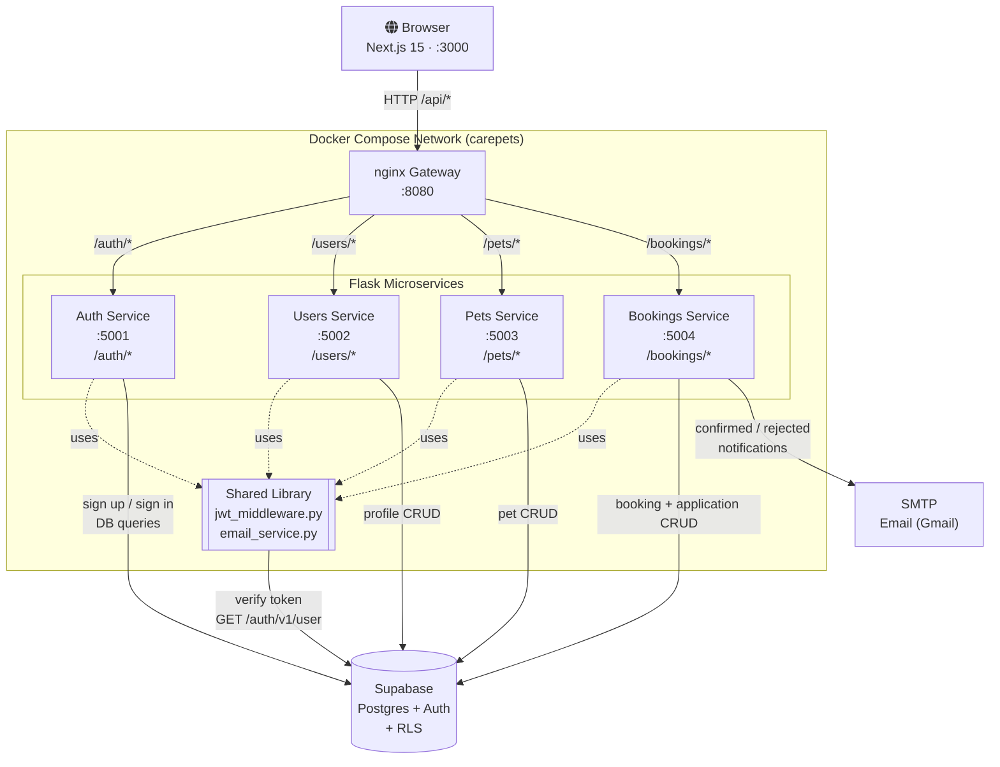
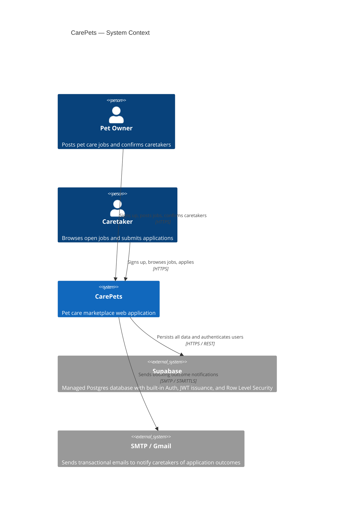
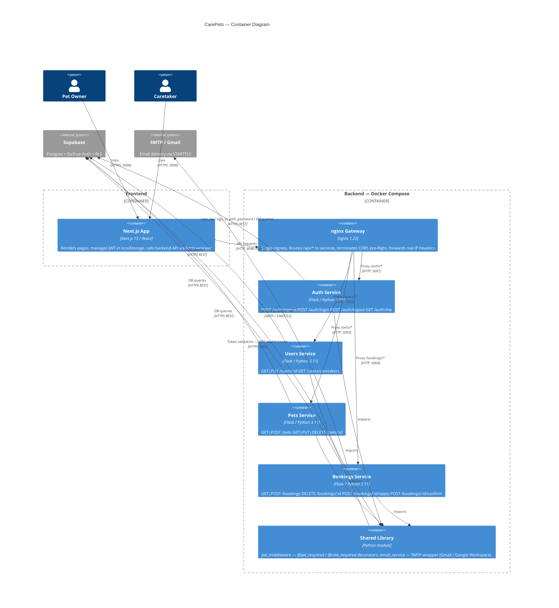
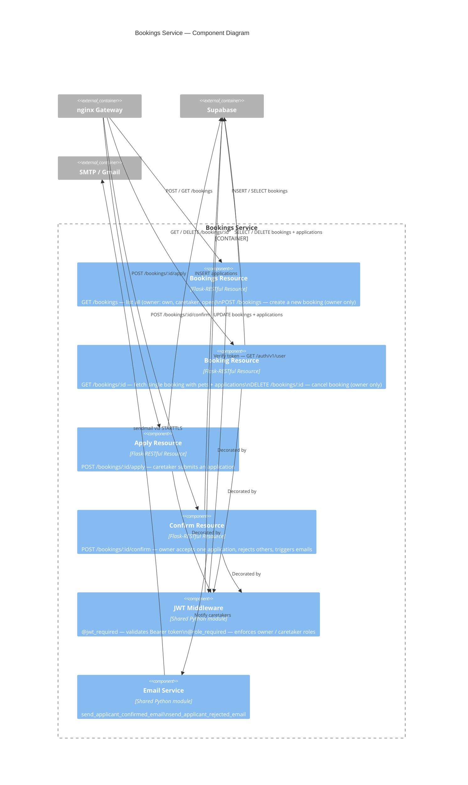

# CarePets

A pet care marketplace connecting pet owners with caretakers. Owners post jobs; caretakers apply; owners confirm.

## Architecture

```
frontend (Next.js 15, port 3000)
    │
    └─▶ gateway (nginx, port 8080)
              ├─▶ auth_service    (Flask, port 5001)  /api/auth/*
              ├─▶ users_service   (Flask, port 5002)  /api/users/*
              ├─▶ pets_service    (Flask, port 5003)  /api/pets/*
              └─▶ bookings_service(Flask, port 5004)  /api/bookings/*

Data layer: Supabase (hosted Postgres + Auth)
```

## Prerequisites

- Docker Desktop (for backend)
- Node.js 20 (for frontend)
- Python 3.11 (for running backend tests locally)
- A [Supabase](https://supabase.com) project

## Supabase Setup

1. Create a new Supabase project.
2. In the **SQL Editor**, run `backend/sql/schema.sql` to create all tables.
3. Run `backend/sql/seed.sql` to populate sample data.
   - Seed creates 7 users (3 owners, 4 caretakers) with password `Password123!`
4. Copy your project credentials from **Project Settings → API**.

## Backend

### Configure

```bash
cp backend/.env.example backend/.env
```

Fill in `backend/.env`:

| Variable | Where to find it |
|---|---|
| `SUPABASE_URL` | Project Settings → API → Project URL |
| `SUPABASE_ANON_KEY` | Project Settings → API → anon/public key |
| `SUPABASE_SERVICE_ROLE_KEY` | Project Settings → API → service_role key |
| `JWT_SECRET` | Project Settings → API → JWT Settings → JWT Secret |
| `SMTP_HOST` | `smtp.gmail.com` for Gmail / Google Workspace |
| `SMTP_PORT` | `587` (STARTTLS) |
| `SMTP_USERNAME` | Your full email address (e.g. `solaiym.2022@scis.smu.edu.sg`) |
| `SMTP_PASSWORD` | Google App Password — generate at **myaccount.google.com → Security → 2-Step Verification → App passwords** (requires 2FA to be enabled first) |

### Run

```bash
cd backend
docker compose up --build
```

This starts the nginx gateway and all four Flask services. The gateway is available at `http://localhost:8080`.

### Test

```bash
# Test a single service
pip install -r backend/services/auth/requirements.txt pytest
cd backend/services/auth
pytest tests/ -v

# Or all services
for svc in auth users pets bookings; do
  pip install -r backend/services/$svc/requirements.txt pytest
  (cd backend/services/$svc && pytest tests/ -v)
done
```

## Frontend

### Configure

Create `frontend/.env.local`:

```
NEXT_PUBLIC_API_URL=http://localhost:8080/api
```

### Run

```bash
cd frontend
npm install
npm run dev
```

Open [http://localhost:3000](http://localhost:3000).

### Test

```bash
cd frontend
npm test -- --watchAll=false
```

### Build

```bash
cd frontend
npm run build
```

## Project Layout

```
PetStore/
├── backend/
│   ├── docker-compose.yaml
│   ├── .env.example
│   ├── gateway/
│   │   └── nginx.conf
│   ├── shared/
│   │   ├── jwt_middleware.py   # @jwt_required / @role_required decorators
│   │   ├── email_service.py    # SMTP helpers
│   │   └── supabase_client.py
│   ├── services/
│   │   ├── auth/               # signup, login, logout, /me
│   │   ├── users/              # profile CRUD, caretaker listing
│   │   ├── pets/               # pet CRUD (owner-only)
│   │   └── bookings/           # booking CRUD, apply, confirm
│   └── sql/
│       ├── schema.sql
│       └── seed.sql
└── frontend/
    ├── app/                    # Next.js App Router pages
    ├── components/             # Shared UI components
    ├── lib/
    │   ├── api.js              # Fetch wrapper with JWT injection
    │   └── auth.js             # AuthContext + useAuth hook
    └── __tests__/              # Jest + Testing Library tests
```

## Notes

- Email notifications (applicant confirmed/rejected) are sent synchronously in the request cycle. For production, move to a background queue.
- JWT verification calls the Supabase `/auth/v1/user` endpoint, which validates RS256-signed tokens server-side.
- Caretaker role is stored in Supabase `user_metadata` during signup and embedded in issued JWTs.

---

## CI Pipeline

The pipeline is defined in [`.github/workflows/ci.yml`](.github/workflows/ci.yml) and runs on every push and pull request to `main`. It consists of three parallel jobs.

### Jobs

#### `backend` (matrix: auth · users · pets · bookings)

Runs once per service using a 4-way matrix strategy so all services are tested in parallel.

| Step | What it does |
|---|---|
| `actions/setup-python@v5` | Provisions Python 3.11 |
| Install dependencies | `pip install -r backend/services/<service>/requirements.txt pytest` |
| Run tests | `pytest tests/ -v` from within the service directory |

Each service is tested in isolation using mocked Supabase clients (via `unittest.mock`) so no real database or network calls are made. Mock environment variables (`SUPABASE_URL`, `JWT_SECRET`, etc.) are injected at the job level.

**Test coverage per service:**

| Service | Tests |
|---|---|
| `auth` | Signup (success, missing fields, invalid role), login (success, invalid credentials), `/me`, logout |
| `users` | Get profile (success, unauthorized), update profile, list caretakers |
| `pets` | List pets, create pet (success, missing fields), update pet, delete pet |
| `bookings` | Create/list/cancel booking, apply to booking (success, closed), confirm applicant, withdraw application, reject application, role enforcement |

#### `frontend`

Runs against the `frontend/` directory using Node.js 20.

| Step | What it does |
|---|---|
| `npm ci` | Installs exact dependencies from `package-lock.json` |
| `npm run lint` | ESLint check across all source files |
| `npm test` | Jest + Testing Library suite (`--watchAll=false --passWithNoTests`) |
| `npm run build` | Next.js production build with `NEXT_PUBLIC_API_URL` set |

**Frontend test coverage:**

| Suite | Tests |
|---|---|
| `auth.test.js` | Login page renders, empty-form validation errors, successful login + redirect, failed login error toast |
| `job-form.test.js` | Form renders after pet load, validation on empty submit, booking creation on valid submit |
| `application-confirm.test.js` | Owner sees applicant list with Confirm button, owner confirm flow, caretaker sees apply form, caretaker apply flow |

#### `docker-build`

Validates that all four service images and the nginx gateway can be built from scratch.

| Step | What it does |
|---|---|
| Create `.env` | Copies `.env.example` to `.env` so `docker compose build` has required variables |
| Build images | `docker compose -f backend/docker-compose.yaml build` across all five services |

This catches Dockerfile errors, missing base images, and broken `COPY` paths before they reach a deployment.

---

## Security Testing

### SAST — Static Application Security Testing

**Tool:** [Bandit](https://bandit.readthedocs.io) v1.9.4  
**Scope:** All backend Python source files (`backend/shared/`, `backend/services/*/app.py`), excluding test directories  
**Run date:** 2026-06-09

**Results summary:**

| Severity | Count |
|---|---|
| High | 5 |
| Medium | 4 |
| Low | 0 |

**Findings:**

| ID | Severity | File | Line | Description |
|---|---|---|---|---|
| B201 | High | `services/auth/app.py` | 138 | `debug=True` on Flask — exposes Werkzeug interactive debugger, allows arbitrary code execution (CWE-94) |
| B201 | High | `services/bookings/app.py` | 253 | Same as above |
| B201 | High | `services/pets/app.py` | 97 | Same as above |
| B201 | High | `services/users/app.py` | 73 | Same as above |
| B501 | High | `shared/jwt_middleware.py` | 15 | `verify=False` on `httpx.get` — disables TLS certificate validation when calling Supabase `/auth/v1/user` (CWE-295) |
| B104 | Medium | `services/auth/app.py` | 138 | Binding to `0.0.0.0` exposes Flask on all network interfaces (CWE-605) |
| B104 | Medium | `services/bookings/app.py` | 253 | Same as above |
| B104 | Medium | `services/pets/app.py` | 97 | Same as above |
| B104 | Medium | `services/users/app.py` | 73 | Same as above |

**Remediation notes:**

- **B201 (`debug=True`):** The `if __name__ == '__main__': app.run(debug=True)` block is only reached when running Flask directly — in production these services run under `gunicorn` inside Docker, so the debugger is never actually activated. For production hardening, change to `debug=False` or read from an environment variable (`debug=os.getenv("FLASK_DEBUG","false").lower()=="true"`).
- **B501 (`verify=False`):** Added as a workaround for local development where Supabase uses a self-signed certificate. For production, remove `verify=False` and ensure the host trusts the Supabase CA. Also note the top-of-file monkey-patch (`_httpx_no_ssl`) that globally disables TLS verification for all `httpx.Client` instances in each service — this should also be removed in production.
- **B104 (bind `0.0.0.0`):** Acceptable inside Docker Compose where the services are on a private bridge network (`carepets`) and only the nginx gateway is externally exposed. No action needed unless services are ever run outside Docker.

---

### DAST — Dynamic Application Security Testing

**Method:** Code-assisted runtime analysis — each endpoint's authentication, authorisation, and input-handling logic was traced against OWASP Top 10 categories. The backend was not reachable during automated scanning; findings are derived from source code review of runtime behaviour.  
**Scope:** All four Flask services + nginx gateway  
**Date:** 2026-06-09

#### Passed checks

| Check | Result | Evidence |
|---|---|---|
| Authentication enforcement | PASS | All mutating endpoints decorated with `@jwt_required`; missing/invalid `Authorization` header returns 401 |
| Role-based access control | PASS | `@role_required('owner')` / `@role_required('caretaker')` enforced on all role-sensitive endpoints; wrong role returns 403 |
| IDOR — profile read/update | PASS | `GET /users/:id` and `PUT /users/:id` compare `g.user_id != user_id` before proceeding |
| IDOR — pet CRUD | PASS | All pet queries filter by `.eq('owner_id', g.user_id)`, preventing cross-user access |
| IDOR — booking confirm/cancel | PASS | `DELETE /bookings/:id` and `POST /bookings/:id/confirm` verify `owner_id = g.user_id` via Supabase query |
| SQL injection | PASS | All DB access uses the Supabase Python client with parameterised queries; no raw SQL string construction found |
| CORS origin restriction | PASS | nginx restricts `Access-Control-Allow-Origin` to `http://localhost:3000` only |
| Ownership on pet-to-booking | PASS | `POST /bookings` verifies the referenced `pet_id` belongs to `g.user_id` before insert |
| Double-booking prevention | PASS | DB `UNIQUE(booking_id, caretaker_id)` constraint prevents duplicate applications |

#### Findings

| # | Severity | Category | Description |
|---|---|---|---|
| D-01 | Medium | Information Disclosure | All services return raw Python exception strings (`return {"error": str(e)}, 400`) in catch blocks. Internal Supabase error messages, table names, and constraint names can be leaked to the client. |
| D-02 | Medium | Missing Security Headers | nginx does not set `X-Content-Type-Options`, `X-Frame-Options`, `Content-Security-Policy`, or `Strict-Transport-Security`. These are required for production hardening. |
| D-03 | Medium | Unauthenticated Data Exposure | `GET /api/users/caretakers` requires no authentication and returns all caretaker profiles including name, bio, and hourly rate. Acceptable if caretaker browsing is intentionally public; should be a documented design decision. |
| D-04 | Low | No Rate Limiting | The login endpoint (`POST /api/auth/login`) has no rate limiting at the nginx or application layer, making it susceptible to credential brute-force. |
| D-05 | Low | JWT Stored in localStorage | The frontend stores JWTs in `localStorage`, which is accessible to JavaScript and vulnerable to XSS-based theft. `httpOnly` cookies are the recommended alternative. |
| D-06 | Low | Verbose Error on Confirm | `POST /bookings/:id/confirm` prints `[email] failed to send to <email>: <error>` to stdout, potentially logging caretaker email addresses in plaintext in container logs. |
| D-07 | Informational | TLS Disabled Globally | The `_httpx_no_ssl` monkey-patch at the top of each service file disables TLS verification for every `httpx.Client` instance in that process — not just the Supabase call. If any third-party HTTP call is ever added to a service, it will also skip certificate validation silently. |

**Remediation notes:**

- **D-01:** Replace `str(e)` with a generic message for unexpected errors. Reserve the raw error only for known validation failures (e.g. missing fields). Example: `return {"error": "An unexpected error occurred"}, 500` in the outer except block.
- **D-02:** Add to `nginx.conf` server block:
  ```nginx
  add_header X-Content-Type-Options "nosniff" always;
  add_header X-Frame-Options "DENY" always;
  add_header Content-Security-Policy "default-src 'self'" always;
  ```
- **D-04:** Add `limit_req_zone` / `limit_req` to nginx for the `/api/auth/login` location, or use Supabase's built-in brute-force protection (enabled by default in the Auth settings).
- **D-05:** Migrate JWT storage from `localStorage` to `httpOnly` `SameSite=Strict` cookies; update the fetch wrapper in `lib/api.js` to send credentials rather than reading from storage.
- **D-07:** Scope the `verify=False` workaround to only the specific `httpx.get` call in `jwt_middleware.py` and remove the global monkey-patch.

---

## Security Considerations

### Password Hashing

Passwords are never stored or handled in plaintext by any CarePets service. The `auth` service passes credentials directly to **Supabase Auth**, which stores passwords hashed with **bcrypt** (cost factor 10). The plain-text password only travels over HTTPS between the client and the auth service, and is never logged or persisted by application code.

### JWT Authentication (RS256)

Supabase issues **RS256-signed JWTs** upon successful login. The private signing key never leaves Supabase's infrastructure. Every protected endpoint runs the `@jwt_required` decorator from `backend/shared/jwt_middleware.py`, which validates the token by calling `GET /auth/v1/user` on the Supabase API — meaning verification always goes back to the issuer rather than relying on a locally-stored secret that could be compromised.

```
Request → Bearer <token>
  └─▶ jwt_middleware.verify_jwt()
        └─▶ POST /auth/v1/user (Supabase)
              ├── valid  → g.user_id, g.role set → handler called
              └── invalid → 401 returned immediately
```

### Role-Based Access Control (RBAC)

The user's role (`owner` or `caretaker`) is embedded in `user_metadata` at signup and propagated through the JWT. The `@role_required('owner')` decorator, stacked on top of `@jwt_required`, gates endpoints so that, for example, a caretaker cannot create a booking or confirm an application. The role is read from the verified JWT payload — it cannot be self-assigned per request.

### Row Level Security (RLS)

Supabase's Postgres RLS policies form a second enforcement layer independent of application code. Key policies:

| Table | Policy |
|---|---|
| `profiles` | Users can only read/update their own row; public read allowed for caretaker browsing |
| `pets` | Owners can only SELECT/INSERT/UPDATE/DELETE their own pets (`auth.uid() = owner_id`) |
| `bookings` | Owners manage their own bookings; caretakers can only SELECT rows with `status = 'open'` |
| `applications` | Caretakers manage their own applications; owners can view applications on their bookings via a subquery |

Even if application-level auth were bypassed, RLS would still prevent cross-user data access. The backend services use the `SERVICE_ROLE_KEY`, which bypasses RLS so services can operate freely, but this key is never exposed to the browser.

### Input Validation

Validation is applied at two boundaries:

- **Frontend** — Zod schemas (e.g., `signup/page.js`) validate field types and constraints before any request leaves the browser.
- **Backend** — Each Flask endpoint checks required fields explicitly (e.g., `if not all([pet_id, start_date, end_date, description])`) and the database enforces `CHECK` constraints on enum-like columns (`role IN ('owner','caretaker')`, `status IN ('open','confirmed','cancelled')`).

### CORS

nginx adds `Access-Control-Allow-Origin: http://localhost:3000` on every response. Pre-flight `OPTIONS` requests return 204 immediately. In production this origin should be updated to the deployed frontend domain.

### Ownership Verification

Application logic verifies ownership before mutations even when RLS is active, providing defence-in-depth:

- Creating a booking: pet existence **and** `owner_id = current user` are both verified before insert.
- Confirming a booking: `bookings.owner_id = current user` is checked before any status updates are made.
- Updating a profile: `user_id` in the URL is compared against `g.user_id` from the JWT.

---

## CIA Triad Analysis

### Confidentiality

| Control | How it is implemented |
|---|---|
| Password secrecy | bcrypt hashing in Supabase Auth; plain-text never stored |
| Data access control | RLS policies restrict rows to their owners |
| Token secrecy | RS256 private key stays in Supabase; service role key never sent to browser |
| Role separation | Caretakers cannot read owner-only data; owners cannot see other owners' pets |
| Transport | All browser → gateway traffic should run over HTTPS in production; nginx forwards `X-Forwarded-Proto` |

### Integrity

| Control | How it is implemented |
|---|---|
| Schema constraints | `CHECK` constraints enforce valid `role` and `status` values at the DB level |
| Uniqueness | `UNIQUE(booking_id, caretaker_id)` prevents a caretaker submitting multiple applications to the same booking |
| Ownership checks | Mutations verify the requesting user owns the resource before proceeding |
| Timestamp accuracy | `updated_at` triggers fire on every `UPDATE`, maintaining an accurate audit trail |
| Atomic status transitions | Confirming a booking updates the booking status and all sibling applications in a single service operation, keeping state consistent |

### Availability

**Current architecture strengths:**

- **Service isolation** — each microservice is an independent container. A crash in the `bookings` service does not affect `auth`, `users`, or `pets`. nginx returns `502` only for routes to the failed service.
- **Managed data layer** — Supabase is a hosted, HA Postgres service with automatic failover and backups; the application does not need to manage database availability itself.
- **Stateless services** — JWT verification is stateless (no session store), so any replica of a service can handle any request.

**How nginx load balancing would improve availability (conceptual):**

nginx's `upstream` blocks already name each backend service. Adding multiple server entries and a balancing policy is the only change required:

```nginx
upstream bookings_service {
    least_conn;                  # route to the instance with fewest active connections
    server bookings_1:5004;
    server bookings_2:5004;
    server bookings_3:5004;
}
```

With `docker compose --scale bookings=3`, nginx would distribute traffic across three replicas using the `least_conn` algorithm and automatically stop routing to any instance that stops responding. This eliminates the bookings service as a single point of failure. The same pattern applies to all four Flask services.

For production, adding `keepalive 32;` to the upstream block reduces connection overhead, and `proxy_next_upstream error timeout` instructs nginx to retry failed requests on the next healthy upstream.

---

## Microservices Architecture Diagram



**Request flow — creating a booking:**

1. Browser sends `POST /api/bookings` with `Authorization: Bearer <JWT>`.
2. nginx matches `/api/bookings` and rewrites + proxies to `bookings:5004/bookings`.
3. `@jwt_required` calls Supabase `/auth/v1/user` to validate the token and populate `g.user_id`.
4. `@role_required('owner')` checks `g.role == 'owner'`.
5. Handler verifies the referenced pet belongs to `g.user_id`, then inserts the booking row.
6. Supabase RLS policies are enforced at the database level as a second check.

---

## C4 Diagram

### Level 1 — System Context



### Level 2 — Container Diagram



### Level 3 — Component Diagram (Bookings Service)


